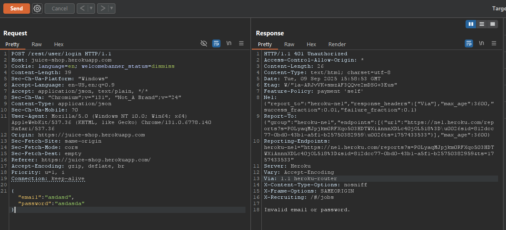
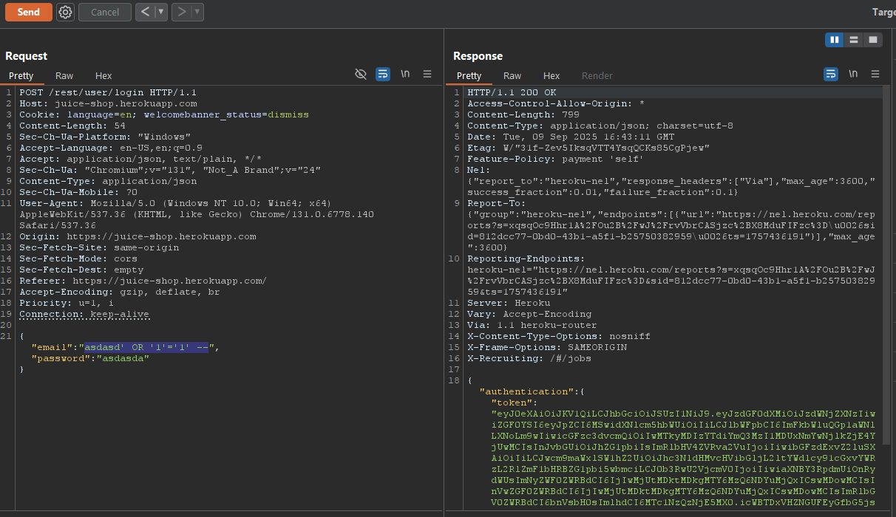
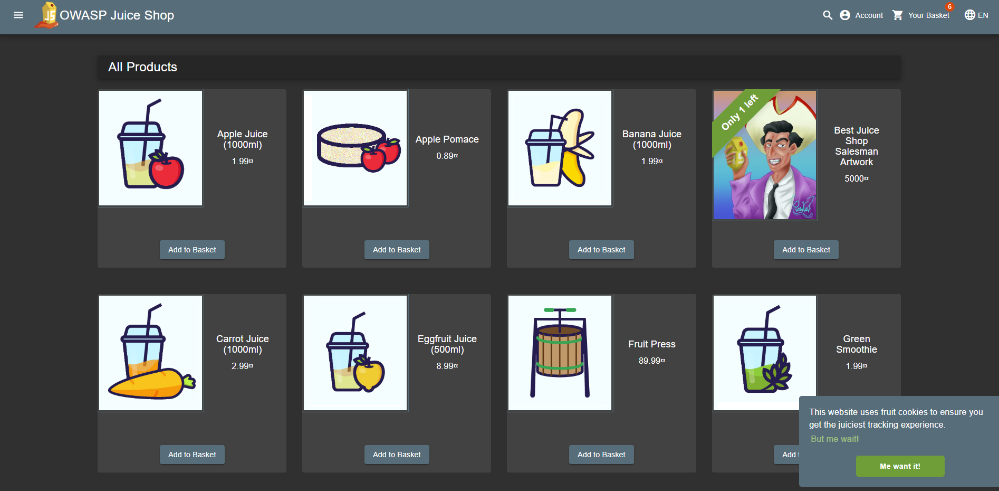

# Laporan Write-Up: Login Admin

## 1. Soal

**Nama Challenge**: `Login Admin`

**Sumber**: `OWASP Juice Shop`

**Tingkat** **Kesulitan**: `⭐⭐ (2/6)`

**Deskripsi Soal**:

Tantangan ini mengharuskan kita untuk mengeksploitasi kerentanan SQL Injection pada proses autentikasi (login) untuk mendapatkan akses tidak sah ke akun administrator aplikasi.

## 2. Link Resource untuk Latihan

* Link Soal/Lab: https://juice-shop.herokuapp.com/#/login

* Tools yang Digunakan:

  * Web Browser (Firefox, Chrome, dll.)

  * Burp Suite (Untuk mencegat dan memodifikasi request HTTP)

## 3. Jawaban dan Bukti

### Langkah-langkah Penyelesaian (Step-by-step)

Berikut adalah langkah-langkah yang dilakukan untuk menyelesaikan tantangan ini:

1. **Identifikasi Vektor Serangan**

   * Analisis awal difokuskan pada mekanisme autentikasi. Pengujian fungsionalitas input dilakukan dengan menyisipkan metakarakter SQL, spesifiknya karakter kutip tunggal (`'`'), pada field email. Aplikasi memberikan respons berupa *verbose error message* yang berkaitan dengan sintaks SQL. Hal ini merupakan indikator kuat adanya *attack surface* untuk kerentanan tipe SQL Injection.

2. **Mencegat Request Login**

    * Menggunakan Burp Suite sebagai *proxy interceptor*, request **HTTP** `POST` yang dikirim selama upaya otentikasi standar berhasil dicegat.

    *Bukti Screenshot (Request Normal):*

    

3. **Memodifikasi dan Mengirim Payload Injeksi**

    * Pada field `email`, disisipkan sebuah *payload* SQL Injection yang dirancang untuk mem-bypass logika pemeriksaan password.
  
    *Payload yang Digunakan:*

    ```sql
    asdasd' OR '1'='1' --
    ```

    * Payload ini mengkonstruksi sebuah *tautology* dalam klausa `WHERE` pada *query* SQL di *backend*, menyebabkan kondisi tersebut selalu dievaluasi sebagai `TRUE`. Akibatnya, sistem mengizinkan otentikasi tanpa memerlukan kredensial yang valid. Request yang telah dimanipulasi ini kemudian diteruskan (*forwarded*) ke server untuk dieksekusi.
    
    *Bukti Screenshot (Request yang Dimodifikasi):*

    

4. **Validasi Eksploitasi**

    * Setelah transmisi request yang dimanipulasi, server memproses *payload* berbahaya tersebut dan memberikan akses. Sesi sebagai akun administrator berhasil dibuat, yang divalidasi dengan munculnya notifikasi penyelesaian tantangan.

    *Bukti Screenshot Flag/Keberhasilan*:

    

### Catatan Hasil Percobaan

* **Status: Berhasil**

* **Analisis Penyebab:**

    Eksploitasi berhasil karena adanya defisiensi dalam *secure coding practices*, secara spesifik ketiadaan sanitasi input dan implementasi *dynamic queries* alih-alih *prepared statements*. *Payload* yang diinjeksikan berhasil memanipulasi struktur logika dari query SQL, di mana klausa `WHERE` diubah menjadi `email = 'asdasd' OR '1'='1' -- ...`. Kondisi tautologis ini selalu dievaluasi sebagai `TRUE`, sehingga secara efektif mengabaikan validasi password.

* **Strategi Remediasi**:

    Tantangan ini mendemonstrasikan krusialnya validasi input di sisi server sebagai lapisan pertahanan (*defense-in-depth*). Sebagai strategi remediasi untuk mencegah kerentanan serupa, beberapa langkah mitigasi fundamental yang harus diimplementasikan adalah:

  1. **Implementasi Prepared Statements**: Menggunakan *prepared statements* dengan *parameterized queries* adalah kontrol keamanan paling efektif untuk memisahkan data dari kode SQL secara kontekstual, sehingga meniadakan vektor injeksi.

  2. **Validasi Input Sisi Server**: Menerapkan validasi input yang ketat (*allowlist-based*) untuk memastikan hanya format dan tipe data yang diharapkan yang diproses oleh *backend*.

  3. **Penanganan Error yang Aman**: Mengonfigurasi mekanisme penanganan error agar tidak membocorkan informasi sensitif (*information disclosure*), seperti detail struktur database atau sintaks SQL internal.