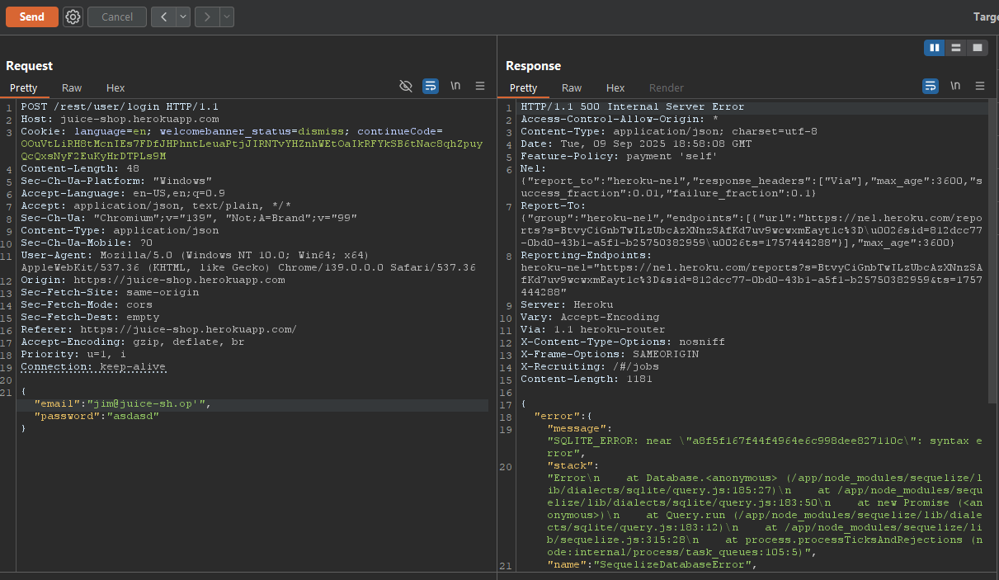
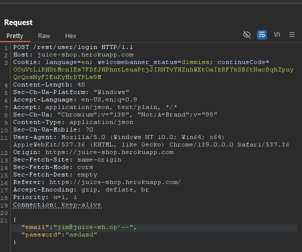
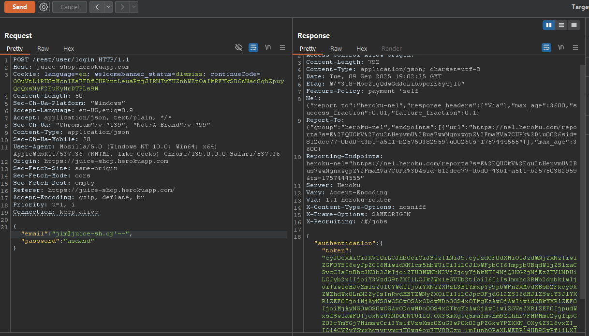
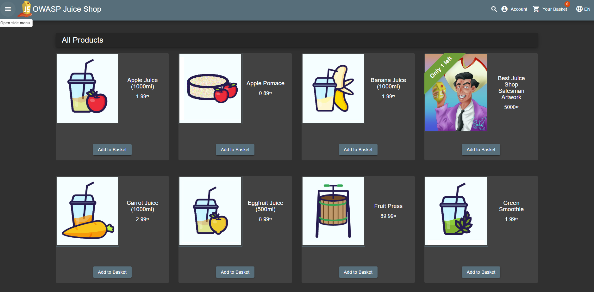

# Laporan Write-Up: Login Jim (OWASP Juice Shop)

## 1. Soal

**Nama Challenge**: **Login Jim**

**Sumber**: OWASP Juice Shop

**Tingkat Kesulitan**: ⭐⭐⭐ (3 dari 6)

**Deskripsi Soal**:

Tantangan ini berfokus pada eksploitasi kerentanan SQL Injection untuk melakukan bypass mekanisme autentikasi dan memperoleh akses tidak sah ke akun pengguna spesifik, yaitu akun milik "Jim".

## 2. Link Resource untuk Latihan

* **Link Soal/Lab**: `https://juice-shop.herokuapp.com`

* **Tools yang Digunakan**:

  * Web Browser (Untuk interaksi dan fase rekognisi)

  * Burp Suite (Sebagai *interception proxy* untuk manipulasi request) 

## 3. Jawaban dan Bukti

### Langkah-langkah Penyelesaian (Step-by-step)

Berikut adalah dekomposisi langkah-langkah teknis yang dieksekusi untuk menyelesaikan tantangan ini:

1. **Rekognisi dan Pengumpulan Informasi**

    Fase awal melibatkan pengumpulan informasi (*information gathering*) untuk mengidentifikasi email yang terasosiasi dengan akun "Jim". Analisis dilakukan pada fungsionalitas ulasan produk (*product reviews*) di dalam aplikasi. Melalui enumerasi manual pada data ulasan, ditemukan sebuah email, `jim@juice-sh.op`, yang secara implisit terkait dengan pengguna target. Penemuan ini merupakan *information disclosure* minor yang krusial untuk tahap selanjutnya.

    

2. **Identifikasi Vektor Serangan**

    Seperti pada tantangan sebelumnya, endpoint login diuji untuk kerentanan SQL Injection. Penyisipan metakarakter kutip tunggal (`'`') pada fi*eld input menghasilkan verbose error message*, yang mengkonfirmasi bahwa input tersebut tidak disanitasi dengan benar dan diproses langsung oleh *database engine*.

    

3. **Konstruksi dan Injeksi Payload**

    Dengan email target yang telah diketahui, sebuah *payload* SQL Injection yang lebih spesifik dapat dikonstruksi. Tujuannya adalah untuk mengautentikasi sebagai `jim@juice-sh.op` tanpa mengetahui passwordnya. Request `POST` ke endpoint login dicegat menggunakan Burp Suite.

    *Payload* yang Digunakan:

    ```sql
    jim@juice-sh.op'--
    ```

    *Payload* ini memanfaatkan karakter komentar SQL (`--`) untuk menginstruksikan *database engine* agar mengabaikan sisa dari *query*, yang dalam konteks ini adalah bagian yang memvalidasi password. *Payload* tersebut disisipkan ke dalam field `email` pada body request JSON.

    *Bukti Screenshot (Request yang Dimodifikasi):*

    

4. **Validasi Eksploitasi**

    Request yang telah dimanipulasi diteruskan ke server. Karena klausa `WHERE` pada *query* autentikasi kini secara efektif hanya memvalidasi email dan mengabaikan password, server memberikan akses. Sesi sebagai pengguna Jim berhasil dibuat, yang divalidasi dengan munculnya notifikasi penyelesaian tantangan.

    *Bukti Screenshot Flag/Keberhasilan:*

    

    

### Catatan Hasil Percobaan

* **Status: Berhasil**

* **Analisis Penyebab:**

    Eksploitasi berhasil karena kombinasi dari dua kerentanan: *information disclosure* yang membocorkan email pengguna dan kerentanan SQL Injection kritis pada fungsi autentikasi. Ketiadaan sanitasi input memungkinkan injeksi karakter komentar SQL, yang secara fundamental mengubah logika eksekusi *query* di *backend* dan memungkinkan *authentication bypass*.

* **Strategi Remediasi:**

    Untuk memitigasi risiko serupa, pendekatan *defense-in-depth* harus diterapkan, yang mencakup:

  1. **Implementasi Prepared Statements**: Ini tetap menjadi kontrol preventif utama terhadap semua varian SQL Injection dengan memastikan pemisahan ketat antara kode dan data.

  2. **Prinsip Hak Istimewa Terkecil (*Least Privilege*)**: Data sensitif seperti email pengguna seharusnya tidak ditampilkan secara publik di fitur seperti ulasan produk. Data harus dianonimkan atau disamarkan.

  3. **Validasi Input Sisi Server**: Menerapkan validasi input yang ketat pada semua *user-controllable input* untuk menolak karakter atau format yang tidak diharapkan.

  4. **Audit dan Pemindaian Keamanan Reguler**: Melakukan penilaian kerentanan secara berkala untuk secara proaktif mengidentifikasi dan memperbaiki kelemahan keamanan sebelum dapat dieksploitasi.

