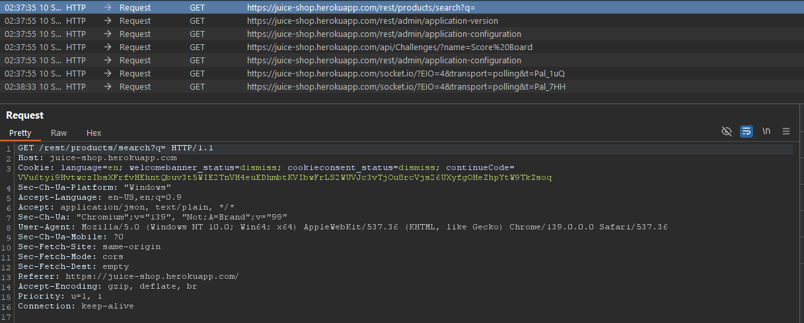
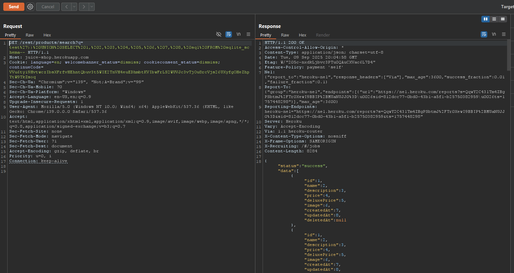
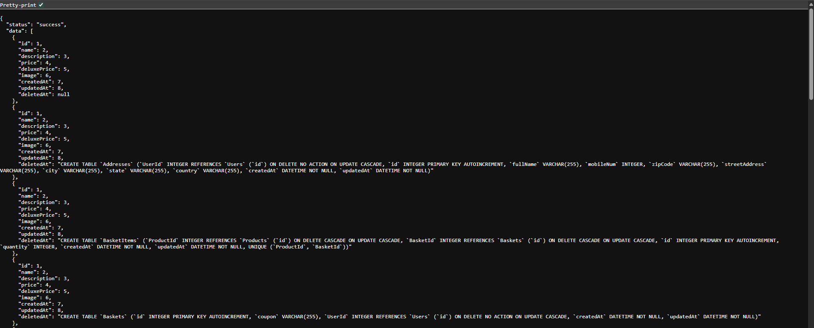

# Laporan Write-Up: Database Schema (OWASP Juice Shop)

## 1. Soal

**Nama Challenge: Database Schema**

**Sumber: OWASP Juice Shop**

**Tingkat Kesulitan: ⭐⭐⭐ (3 dari 6)**

**Deskripsi Soal:**

Tantangan ini menguji kemampuan untuk mengekstraksi skema database melalui kerentanan SQL Injection. Tujuannya adalah untuk mengungkap detail struktural sensitif dari database backend, yang merupakan bentuk dari *Information Disclosure*.

## 2. Link Resource untuk Latihan

* **Link Soal/Lab**: `https://juice-shop.herokuapp.com/#/search`

* **Tools yang Digunakan**:

  * Web Browser (Untuk interaksi dengan aplikasi)

  * HTTP Interception Proxy (Contoh: Burp Suite)

## 3. Jawaban dan Bukti

### Langkah-langkah Penyelesaian (Step-by-step)

Berikut adalah dekomposisi langkah-langkah teknis yang dieksekusi untuk menyelesaikan tantangan ini:

1. **Identifikasi Titik Injeksi (Injection Point)**

    Analisis fungsionalitas aplikasi mengarah pada fitur pencarian produk sebagai vektor serangan potensial. Endpoint yang rentan diidentifikasi pada path `/rest/products/search`, dengan parameter `q` yang menerima input dari pengguna. Pengujian awal dengan metakarakter SQL mengindikasikan adanya kerentanan.

    

2. **Enumerasi Jumlah Kolom**

    Sebelum melakukan serangan *UNION-based*, perlu ditentukan jumlah kolom yang dikembalikan oleh *query* asli. Proses ini dilakukan dengan menyisipkan klausa `ORDER BY` secara iteratif (misal, `ORDER BY 1`, `ORDER BY 2`, dst.) hingga aplikasi mengembalikan error. Dari proses ini, diketahui bahwa `query` asli mengembalikan 9 kolom.

3. **Konstruksi dan Injeksi Payload Ekstraksi Skema**

    Dengan jumlah kolom yang telah diketahui, sebuah *payload UNION-based SQL Injection* dirancang untuk mengekstrak informasi skema dari tabel `sqlite_schema`, yang merupakan tabel metadata standar pada database SQLite.

    *Payload yang Digunakan:*

    ```sql
    x')) UNION SELECT 1,2,3,4,5,6,7,8,sql FROM sqlite_schema--
    ```

    **Dekomposisi Payload:**

    * `x'))`: Digunakan untuk menutup sintaks *query* asli yang ada di *backend* dengan benar.

    * `UNION SELECT ...`: Menggabungkan hasil dari *query* berbahaya dengan hasil dari *query* asli.

    * `1,2,3,4,5,6,7,8`: Nilai placeholder untuk 8 kolom pertama agar tipe datanya sesuai.

    * `sql`: Kolom target dari tabel `sqlite_schema` yang berisi definisi skema (perintah `CREATE TABLE`).

    * `FROM sqlite_schema`: Menargetkan tabel metadata `sqlite_schema`.

    * `--`: Karakter komentar untuk menonaktifkan sisa dari *query* asli di *backend*.

4. **Ekstraksi dan Validasi Hasil**

    *Payload* tersebut diinjeksikan melalui parameter `q` pada URL. Karena jumlah kolom pada *query* `UNION` sudah sesuai, aplikasi memprosesnya dan menampilkan konten dari kolom `sql` (definisi skema database) sebagai bagian dari hasil pencarian produk. Ini mengonfirmasi keberhasilan ekstraksi skema dan menyelesaikan tantangan.

    *Bukti Screenshot (Hasil Ekstraksi Skema):*

    

    

### Catatan Hasil Percobaan

* **Status: Berhasil**

* **Analisis Penyebab:**

    Kerentanan ini berakar pada kegagalan aplikasi untuk melakukan sanitasi dan validasi pada input yang dikontrol oleh pengguna (*user-controllable input*). Hal ini memungkinkan eksekusi serangan *UNION-based SQL Injection*, yang dapat dimanfaatkan untuk melakukan *data exfiltration*. Dalam kasus ini, data yang diekstrak adalah metadata skema database, yang merupakan kerentanan *Information Disclosure* kritis.

* **Strategi Remediasi:**

    Strategi mitigasi yang komprehensif harus mencakup beberapa lapisan pertahanan untuk mencegah eksploitasi serupa:

    1. **Implementasi Prepared Statements:** Penggunaan *parameterized queries* adalah kontrol keamanan utama yang secara fundamental mencegah SQL Injection dengan memisahkan data dari logika *query*.

    2. **Validasi Input Berbasis Allowlist:** Menerapkan aturan validasi yang ketat di sisi server untuk hanya mengizinkan karakter dan format yang telah ditentukan secara eksplisit.

    3. **Prinsip Hak Istimewa Terkecil (*Least Privilege*):** Akun database yang digunakan oleh aplikasi web seharusnya hanya memiliki hak akses minimum yang diperlukan untuk operasinya, membatasi dampak jika terjadi kompromi.

    4. **Konfigurasi Error Handling yang Aman:** Hindari menampilkan pesan error teknis kepada pengguna akhir, karena dapat memberikan petunjuk berharga kepada penyerang mengenai struktur internal aplikasi dan database.