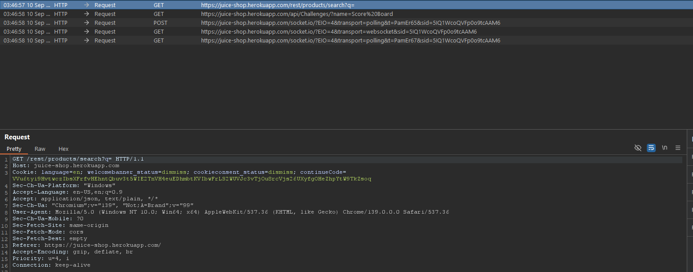
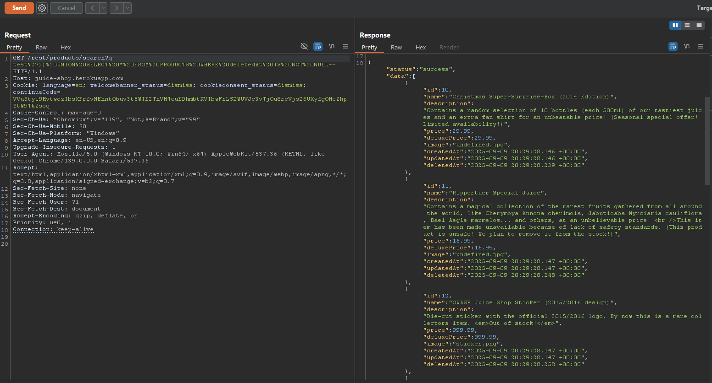
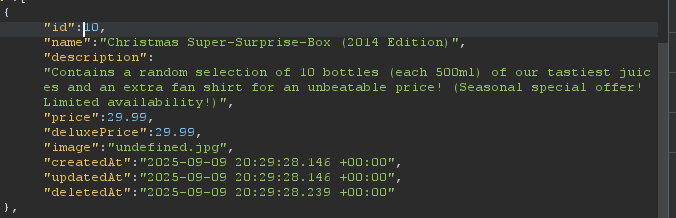
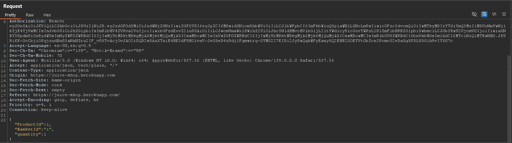
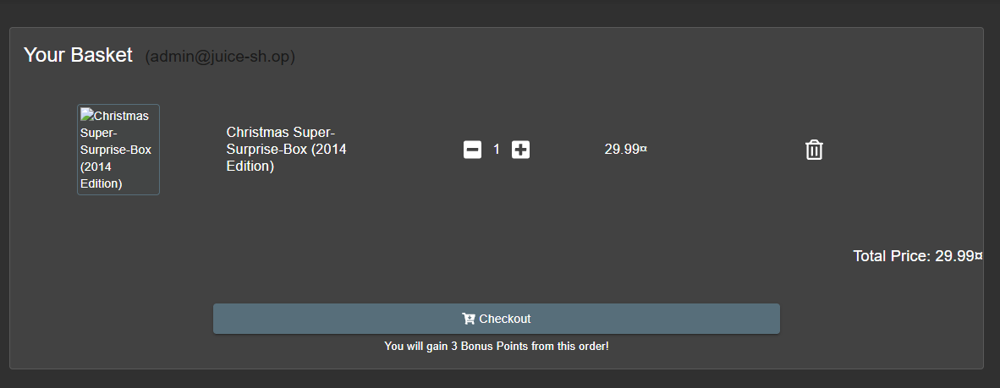

# Laporan Write-Up: Christmas Offer (OWASP Juice Shop)

## 1. Soal

**Nama Challenge: Christmas Offer**

**Sumber: OWASP Juice Shop**

**Tingkat Kesulitan: ⭐⭐⭐⭐ (4 dari 6)**

**Deskripsi Soal:**

Tantangan ini mengharuskan eksploitasi kerentanan SQL Injection untuk mengakses dan menambahkan produk penawaran khusus (Christmas Offer) ke keranjang belanja. Produk ini tidak terlihat pada daftar produk normal karena telah ditandai sebagai dihapus (*logically deleted*) di dalam database.

## 2. Link Resource untuk Latihan

* **Link Soal/Lab:** `https://juice-shop.herokuapp.com/#/search`

* **Tools yang Digunakan:**

  * Web Browser (Untuk interaksi dengan antarmuka aplikasi)

  * HTTP Interception Proxy (Contoh: Burp Suite untuk manipulasi request)

## 3. Jawaban dan Bukti

### Langkah-langkah Penyelesaian (Step-by-step)

Berikut adalah dekomposisi langkah-langkah teknis yang dieksekusi untuk menyelesaikan tantangan ini:

1. **Identifikasi Titik Injeksi (*Injection Point*)**

    Fungsionalitas pencarian produk pada endpoint `/rest/products/search` dengan parameter `q` diidentifikasi sebagai vektor serangan yang rentan terhadap SQL Injection, sebagaimana telah divalidasi pada tantangan sebelumnya.

    

2. **Konstruksi Payload untuk Menemukan Produk Tersembunyi**

    Dibuat hipotesis bahwa produk yang disembunyikan atau penawaran khusus tidak dihapus secara fisik (*physical deletion*), melainkan ditandai melalui *logical deletion*, kemungkinan besar dengan mengisi kolom `deletedAt` dengan sebuah *timestamp*. Berdasarkan hipotesis ini, sebuah *payload UNION-based* dirancang untuk mengekstrak produk-produk tersebut.

    *Payload yang Digunakan:*

    ```sql
    test')) UNION SELECT * FROM PRODUCTS WHERE deletedAt IS NOT NULL--
    ```

    * **Analisis Payload**: Payload ini dirancang untuk mengambil semua kolom (`SELECT *`) dari tabel Products di mana kolom `deletedAt` memiliki nilai (bukan `NULL`), yang mengindikasikan produk tersebut telah ditandai sebagai dihapus.

    

3. **Ekstraksi Informasi Produk**

    Eksekusi payload melalui parameter `q` berhasil meng-ekfiltrasi data produk yang tersembunyi, termasuk 'Christmas Offer'. Dari data yang diekstrak, `ProductId` untuk produk ini diidentifikasi sebagai `10`.

    

4. **Manipulasi Keranjang Belanja via Request HTTP**

    * Untuk menambahkan produk tersembunyi, pertama-tama request `POST` untuk menambahkan produk normal ke keranjang belanja dicegat menggunakan Burp Suite untuk menganalisis strukturnya.

    

    * Selanjutnya, request tersebut dimodifikasi. Nilai dari parameter `ProductId` di dalam body JSON diubah menjadi `10` (ID produk Christmas Offer).

    * Request yang telah dimanipulasi ini kemudian diteruskan ke server, yang memproses penambahan produk tersembunyi ke keranjang belanja, sehingga menyelesaikan tantangan.

    *Bukti Screenshot (Manipulasi Request & Keranjang Belanja):*

    

### Catatan Hasil Percobaan

* **Status: Berhasil**

* **Analisis Penyebab:**\
    Keberhasilan eksploitasi ini disebabkan oleh dua kelemahan utama: (1) kerentanan SQL Injection pada endpoint pencarian yang memungkinkan *data exfiltration*, dan (2) penggunaan praktik *logical deletion* yang tidak aman, di mana data yang seharusnya tidak dapat diakses publik masih tersimpan di database dan dapat di-query melalui *endpoint* yang rentan.

* **Strategi Remediasi:**\
    Untuk memitigasi risiko semacam ini, pendekatan keamanan berlapis (*defense-in-depth*) sangat direkomendasikan:

  1. **Implementasi Prepared Statements**: Tetap menjadi kontrol preventif yang paling efektif terhadap SQL Injection dengan memastikan pemisahan ketat antara data dan logika *query*.

  2. **Penghapusan Data yang Aman (*Secure Deletion*):** Alih-alih menggunakan *logical deletion* untuk data yang seharusnya tidak dapat diakses lagi, praktik yang lebih aman adalah melakukan *physical deletion* (menghapus baris data sepenuhnya) atau memindahkan data ke tabel arsip yang tidak dapat diakses oleh *endpoint* publik.

  3. **Kontrol Akses Berbasis Logika Bisnis:** Seharusnya ada lapisan validasi di *backend* yang memeriksa apakah suatu produk yang ditambahkan ke keranjang belanja adalah produk yang aktif dan dapat dibeli, terlepas dari bagaimana request itu dibuat. Ini mencegah *bypass* logika bisnis di sisi klien.

