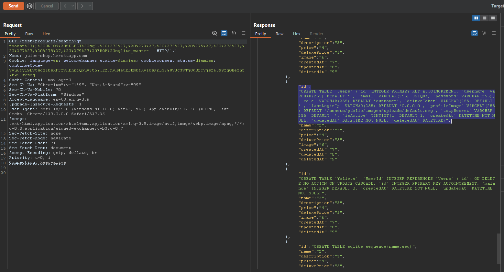
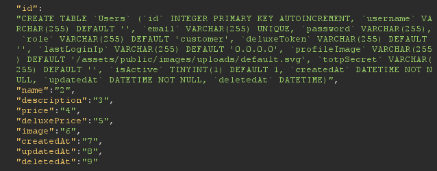
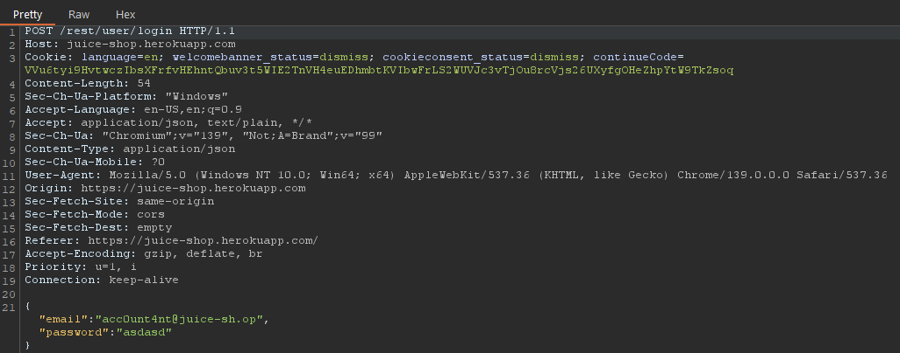
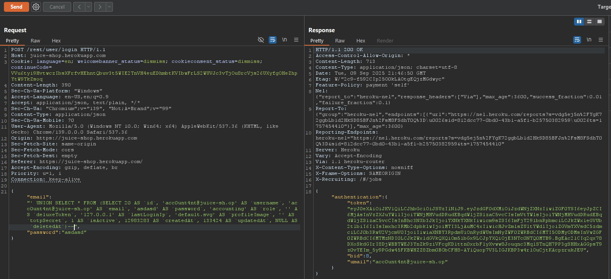

# Laporan Write-Up: Ephemeral Accountant (OWASP Juice Shop)

## 1. Soal

**Nama Challenge:** **Ephemeral Accountant**

**Sumber: OWASP Juice Shop**

**Tingkat Kesulitan: ⭐⭐⭐⭐ (4 dari 6)**

**Deskripsi Soal:**

Tantangan ini melibatkan penggunaan SQL Injection untuk mensimulasikan login dari pengguna yang tidak ada namun dibuat secara temporer ("acc0unt4nt@juice-sh.op") melalui query yang dimanipulasi, tanpa menambahkan akun tersebut secara permanen ke dalam database.

## 2. Link Resource untuk Latihan

* **Link Soal/Lab:** `https://juice-shop.herokuapp.com/#/login`

* **Tools yang Digunakan:**

* Web Browser (Untuk interaksi dengan aplikasi)

* HTTP Interception Proxy (Contoh: Burp Suite)

## 3. Jawaban dan Bukti

### Langkah-langkah Penyelesaian (Step-by-step)

Berikut adalah dekomposisi langkah-langkah teknis yang dieksekusi untuk menyelesaikan tantangan ini:

1. **Rekognisi: Enumerasi Struktur Tabel Pengguna**

    Langkah awal adalah memahami struktur tabel *Users* untuk dapat mereplikasi record pengguna secara akurat. Vektor serangan SQL Injection pada fungsionalitas pencarian produk dimanfaatkan untuk mengekstrak skema tabel dari `sqlite_master`.

    *Payload Enumerasi:*

    ```sql
    foobar')) UNION SELECT sql, '2', '3', '4', '5', '6', '7', '8', '9' FROM sqlite_master WHERE name='Users'--
    ```

    Eksekusi *payload* ini berhasil mengungkap skema DDL (`Data Definition Language`) untuk tabel Users, yang memberikan informasi detail mengenai nama kolom, tipe data, dan urutannya. Ini adalah langkah krusial untuk membangun *payload* berikutnya.

    

    

2. **Analisis Fungsionalitas Autentikasi**

    Request `POST` standar ke endpoint `/rest/user/login` dicegat untuk dianalisis. Ini mengonfirmasi bahwa kredensial dikirim dalam format JSON dengan field `email` dan `password`.

    

3. **Konstruksi Payload Injeksi Pengguna Ephemeral**

    Berdasarkan skema tabel `Users` yang telah diekstraksi, sebuah *payload UNION SELECT* yang kompleks dirancang. Tujuannya adalah untuk membuat sebuah baris (row) pengguna secara temporer (in-memory) selama eksekusi query autentikasi.

    *Payload Injeksi:*

    ```json
    {
    "email": "' UNION SELECT * FROM (SELECT 20 AS `id`, 'acc0unt4nt@juice-sh.op' AS `username`, 'acc0unt4nt@juice-sh.op' AS `email`, 'asdasd' AS `password`, 'accounting' AS `role`, '' AS `deluxeToken`, '127.0.0.1' AS `lastLoginIp`, 'default.svg' AS `profileImage`, '' AS `totpSecret`, 1 AS `isActive`, 12983283 AS `createdAt`, 133424 AS `updatedAt`, NULL AS `deletedAt`)--",
    "password": "any-password"
    }
    ```

    **Analisis Payload:**

   * `' UNION SELECT * FROM ...`: Menggabungkan hasil dari *subquery* buatan dengan *query* autentikasi asli.

   * `(SELECT ... AS tmp)`: Membuat sebuah tabel turunan (*derived table*) yang berisi satu baris data pengguna yang lengkap, dengan setiap kolom (`id`, `username`, `email`, dll.) diisi dengan nilai statis yang sesuai.

   * `--`: Mengomentari sisa dari *query* SQL asli untuk mencegah *syntax errors*.

4. **Eksekusi dan Validasi**

    *Payload* JSON yang telah dimodifikasi disisipkan ke dalam body request `POST` dan dikirim ke server. *Database engine* memproses *query* yang diinjeksi, yang mengembalikan record pengguna "ephemeral". Lapisan aplikasi kemudian memproses record ini seolah-olah berasal dari database yang sah, mengautentikasi pengguna, dan mengembalikan sebuah JSON Web Token (JWT), yang menandakan login berhasil dan penyelesaian tantangan.

    *Bukti Screenshot (Respon JWT dari Server):*

    

### Catatan Hasil Percobaan

* **Status: Berhasil**

* **Analisis Penyebab:**\
Kerentanan ini timbul dari *dynamic query construction* pada fungsi login yang rentan terhadap *UNION-based SQL Injection*. Aplikasi gagal memvalidasi dan mensanitasi input, memungkinkan penyisipan klausa `UNION SELECT` yang kompleks. Serangan ini secara efektif "membuat" record pengguna temporer dalam *result set* yang dikembalikan ke aplikasi. Logika aplikasi, yang tidak dapat membedakan antara data asli dan data yang diinjeksi, kemudian melanjutkan proses autentikasi berdasarkan data palsu tersebut.

* **Strategi Remediasi:**\
Pencegahan eksploitasi semacam ini memerlukan pendekatan keamanan berlapis yang kuat:

  1. **Implementasi Prepared Statements:** Penggunaan *parameterized queries* adalah kontrol keamanan fundamental untuk memastikan bahwa input pengguna selalu diperlakukan sebagai data, bukan sebagai kode yang dapat dieksekusi, sehingga menetralkan vektor SQL Injection.

  2. **Validasi Input yang Ketat:** Menerapkan validasi sisi server yang ketat dengan pendekatan *allowlist* untuk menolak input yang mengandung format atau karakter yang tidak diharapkan.

  3. **Verifikasi Eksistensi Akun Sisi Server:** Sebelum memproses logika login, seharusnya ada langkah verifikasi terpisah yang aman untuk memeriksa apakah akun benar-benar ada di database, meskipun ini harus diimplementasikan dengan hati-hati untuk menghindari kerentanan enumerasi pengguna.