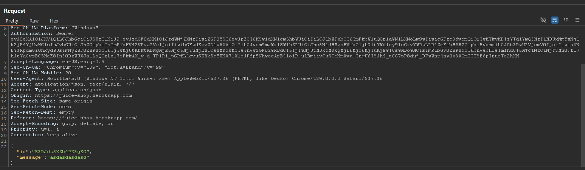
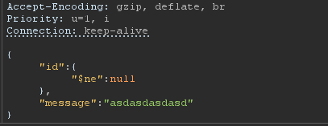
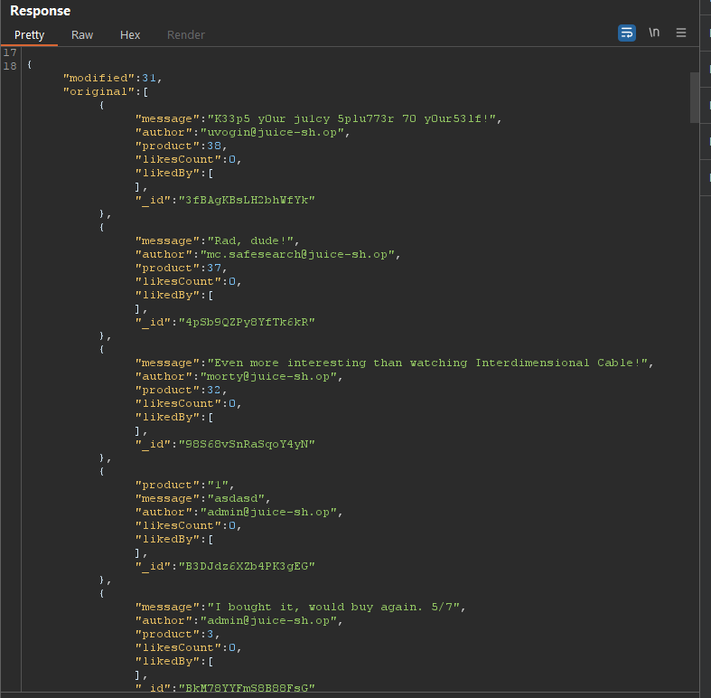

# Laporan Write-Up: NoSQL Manipulation (OWASP Juice Shop)

## 1. Soal

**Nama Challenge: NoSQL Manipulation**

**Sumber: OWASP Juice Shop**

**Tingkat Kesulitan: ⭐⭐⭐⭐ (4 dari 6)**

**Deskripsi Soal:**

Tantangan ini melibatkan eksploitasi kerentanan NoSQL Injection pada fungsionalitas pembaruan ulasan produk. Tujuannya adalah untuk memanipulasi *query* database NoSQL (MongoDB) untuk melakukan pembaruan massal (*bulk update*) pada beberapa ulasan secara bersamaan, sebuah tindakan yang seharusnya tidak diizinkan oleh logika aplikasi.

## 2. Link Resource untuk Latihan

* **Link Soal/Lab:** `https://juice-shop.herokuapp.com/#/search`

* **Tools yang Digunakan:**

  * Web Browser (Untuk interaksi dengan aplikasi)

  * HTTP Interception Proxy (Contoh: Burp Suite untuk analisis dan manipulasi request)

## 3. Jawaban dan Bukti

### Langkah-langkah Penyelesaian (Step-by-step)

Berikut adalah dekomposisi langkah-langkah teknis yang dieksekusi untuk menyelesaikan tantangan ini:

1. **Analisis Request Pembaruan Standar**

    Langkah awal adalah menganalisis mekanisme pembaruan ulasan yang sah. Sebuah request `PATCH` ke endpoint `/rest/products/reviews` dicegat menggunakan Burp Suite. Analisis menunjukkan bahwa request tersebut mengirimkan payload JSON yang berisi `id` dari ulasan spesifik yang akan diubah dan `message` baru.

    

2. **Identifikasi Vektor Injeksi NoSQL**

    Titik masuk untuk injeksi diidentifikasi pada field `id` dalam payload JSON. Hipotesisnya adalah bahwa aplikasi secara langsung menggunakan konten dari field `id` ini dalam *query filter* MongoDB di sisi server tanpa validasi atau sanitasi yang memadai. Ini membuka kemungkinan untuk menyisipkan operator *query* MongoDB alih-alih nilai string ID literal.

3. **Konstruksi Payload NoSQL Injection**

    Untuk mencapai pembaruan massal, diperlukan sebuah kondisi yang akan dievaluasi sebagai `TRUE` untuk semua dokumen dalam koleksi ulasan. Operator MongoDB `$ne` (*not equal*) dipilih untuk tujuan ini.

    *Payload Injeksi:*

    ```json
    {
    "id": {"$ne": null},
    "message": "This review has been updated by a NoSQL Injection attack."
    }
    ```
    
    **Analisis Payload:**

    `{"$ne": null}`: Payload ini menggantikan ID string yang diharapkan. Ketika diproses oleh MongoDB, ini diterjemahkan menjadi *query filter* yang mencari semua dokumen di mana field `_id` tidak sama dengan `null`. Karena setiap dokumen dalam koleksi dijamin memiliki `_id`, kondisi ini secara efektif menargetkan semua ulasan yang ada.

    

4. **Eksekusi Serangan dan Validasi**

    * Payload JSON yang telah dimodifikasi disisipkan ke dalam body request `PATCH` dan dikirim ke server. Server, yang tidak mampu membedakan antara input data yang sah dan operator *query* yang diinjeksi, meneruskan payload tersebut ke database. Akibatnya, database mengeksekusi perintah pembaruan massal.

    * Keberhasilan serangan divalidasi dengan memeriksa beberapa ulasan produk di antarmuka web dan mengonfirmasi bahwa semuanya telah diperbarui dengan teks pesan yang sama dari *payload*.

    *Bukti Screenshot (Request yang Dimodifikasi & Hasil):*

    

### Catatan Hasil Percobaan

* **Status: Berhasil**

* **Analisis Penyebab:**\
    Akar penyebab kerentanan ini adalah kegagalan aplikasi untuk memberlakukan validasi skema yang ketat pada input JSON yang diterima dari klien. Aplikasi secara naif mempercayai bahwa field `id` akan selalu berisi nilai string. Ketika sebuah objek JSON yang berisi operator MongoDB dikirimkan, *driver* database di sisi server menginterpretasikannya sebagai bagian dari logika *query* alih-alih sebagai nilai literal. Ini adalah contoh klasik dari kerentanan NoSQL Injection yang timbul dari *improper input validation*.

* **Strategi Remediasi:**\
    Untuk memitigasi kerentanan NoSQL Injection, beberapa lapisan pertahanan harus diimplementasikan:

  1. **Validasi Skema Input yang Ketat:** Menerapkan validasi di sisi server untuk memastikan bahwa tipe data dan struktur input sesuai dengan yang diharapkan. Misalnya, memastikan bahwa `id` adalah sebuah string dan bukan objek.

  2. **Sanitasi Input:** Membersihkan input dari karakter atau sintaks yang terkait dengan operator database (misalnya, karakter yang diawali dengan `$`).

  3. **Penggunaan *Object-Document Mapper* (ODM):** Menggunakan library ODM seperti Mongoose (untuk Node.js/MongoDB) dapat membantu dalam menegakkan skema model data yang ketat dan secara inheren mengurangi risiko injeksi.

  4. **Prinsip Hak Istimewa Terkecil (*Least Privilege*):** Mengonfigurasi pengguna database dengan hak akses minimum yang diperlukan, membatasi operasi yang dapat dilakukan bahkan jika terjadi injeksi.