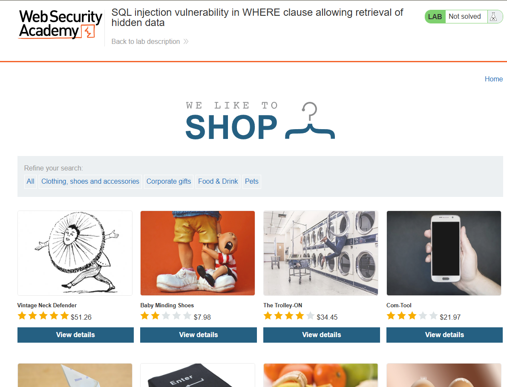
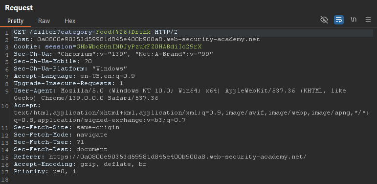
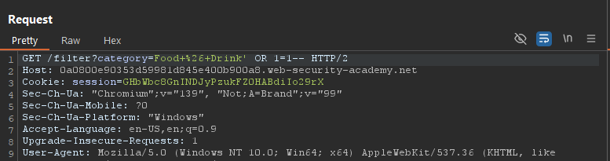
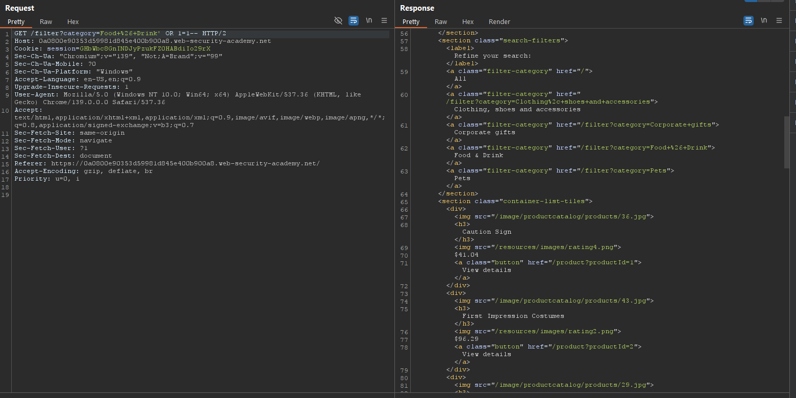
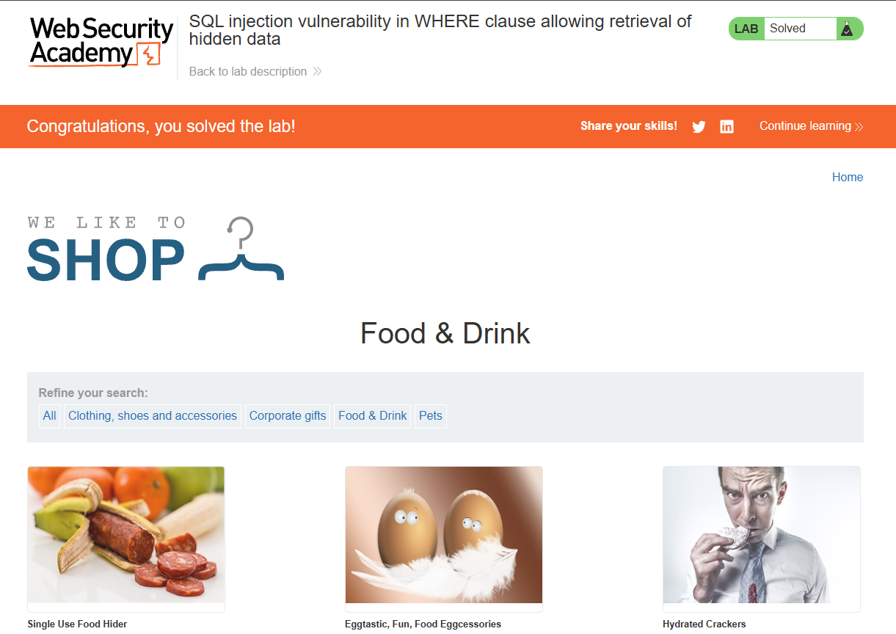

# Laporan Write-Up: SQL Injection Vulnerability in WHERE Clause (Retrieve Hidden Data)

## 1. Soal

**Nama Challenge:** `SQL Injection Vulnerability in WHERE Clause (Retrieve Hidden Data`

**Sumber:** `PortSwigger Web Security Academy`

**Tingkat Kesulitan:** `APPRENTICE`

**Deskripsi Soal:**\
Laboratorium ini memiliki kerentanan SQL Injection pada fungsionalitas filter kategori produk. Tujuan dari eksploitasi ini adalah untuk memanipulasi query database agar menampilkan semua produk yang ada, termasuk produk-produk yang seharusnya tersembunyi atau tidak dirilis, dengan cara mem-bypass klausa `WHERE` pada query SQL.

## 2. Link Resource untuk Latihan

* **Link Soal/Lab:** `https://portswigger.net/web-security/sql-injection/lab-retrieve-hidden-data`

* **Tools yang Digunakan:**

    * Web Browser

    * HTTP Interception Proxy (Contoh: Burp Suite)

## 3. Jawaban dan Bukti

### Langkah-langkah Penyelesaian (Step-by-step)

Berikut adalah dekomposisi langkah-langkah teknis yang dieksekusi для menyelesaikan tantangan ini:

1. **Analisis Fungsionalitas Aplikasi**

    Aplikasi web menampilkan daftar produk yang dapat difilter berdasarkan kategori. Saat sebuah kategori dipilih (misalnya, "Pets"), hanya produk yang relevan dengan kategori tersebut yang ditampilkan. Ini mengindikasikan bahwa input dari pengguna (nama kategori) digunakan untuk membangun query database di sisi backend.

    

2. **Identifikasi Vektor Serangan dan Intersepsi Request**

    Dengan menggunakan Burp Suite sebagai proxy, request `GET` yang dikirim saat memilih kategori "Food & Drink" berhasil dicegat. Analisis menunjukkan bahwa nama kategori dikirim melalui parameter `category` pada URL.

    *Request Asli:*

    ```
    GET /filter?category=Food+%26+Drink HTTP/1.1
    Host: <lab-id>.web-security-academy.net
    ```

    Parameter `category` ini diidentifikasi sebagai vektor serangan potensial.

    

3. **Konstruksi dan Injeksi Payload**

    Request yang telah dicegat dikirim ke Burp Repeater untuk dimodifikasi. Sebuah payload SQL Injection klasik berbasis tautologi dirancang untuk memanipulasi logika klausa `WHERE`.

    *Payload Injeksi:*
    
    ```sql
    ' OR 1=1--
    ```

    Payload ini ditambahkan ke nilai parameter `category`, mengubah URL menjadi:

    ```sql
    /filter?category=Food+%26+Drink' OR 1=1--
    ```

    

4. **Eksekusi dan Validasi Hasil**

    * Request yang telah dimodifikasi dikirim ke server. Respons dari server kini berisi daftar lengkap semua produk dari berbagai kategori, bukan hanya kategori "Food & Drink".

    * Hasil ini divalidasi dengan merender respons di browser, yang menunjukkan semua produk, termasuk yang sebelumnya tersembunyi.

    * Keberhasilan eksploitasi dikonfirmasi dengan munculnya spanduk "Congratulations, you solved the lab!" di halaman lab.

    *Bukti Screenshot (Hasil Tampilan Semua Produk & Status Solved):*

    

    

### Catatan Hasil Percobaan

* **Status: Berhasil**

* **Analisis Penyebab:**\
Kerentanan ini muncul karena aplikasi menyusun query SQL secara dinamis dengan menggabungkan input mentah dari parameter `category` tanpa sanitasi atau validasi.

  * Query Asli (diasumsikan):

    ```sql
    SELECT * FROM products WHERE category = 'Pets' AND released = 1;
    ```

  * Setelah Injeksi, Query menjadi:

    ```sql
    SELECT * FROM products WHERE category = 'Pets' OR 1=1--' AND released = 1;
    ```
* **Analisis Query yang Dimanipulasi:**
    
    * `OR 1=1`: Kondisi ini menciptakan sebuah tautologi, yang menyebabkan klausa `WHERE` selalu dievaluasi sebagai `TRUE` untuk setiap baris data di tabel `products`.
    
    * `--`: Ini adalah sintaks komentar dalam SQL, yang menyebabkan sisa dari query asli (yaitu, `' AND released = 1;`) diabaikan oleh database engine.
    Akibatnya, database mengembalikan semua entri dari tabel `products`, mengabaikan filter kategori dan status rilis.

* **Strategi Remediasi:**

    * **Implementasi Prepared Statements:** Penggunaan *parameterized queries* adalah metode pertahanan yang paling efektif. Ini memastikan bahwa input pengguna selalu diperlakukan sebagai data dan tidak akan pernah diinterpretasikan sebagai kode SQL yang dapat dieksekusi.

    * **Validasi Input Berbasis Allowlist:** Menerapkan validasi di sisi server untuk memastikan bahwa nilai parameter `category` hanya berisi salah satu dari daftar kategori yang telah ditentukan sebelumnya.