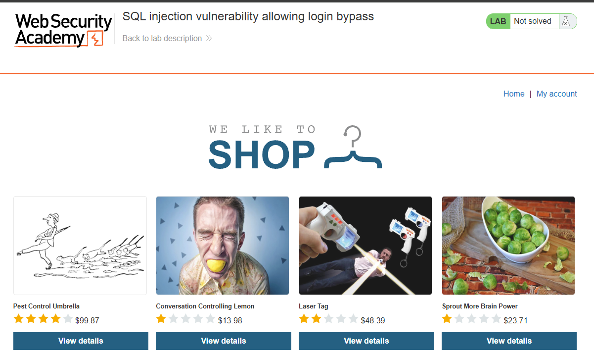
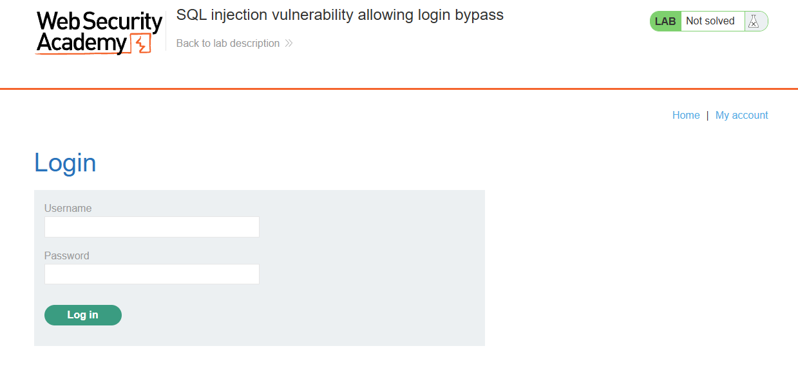
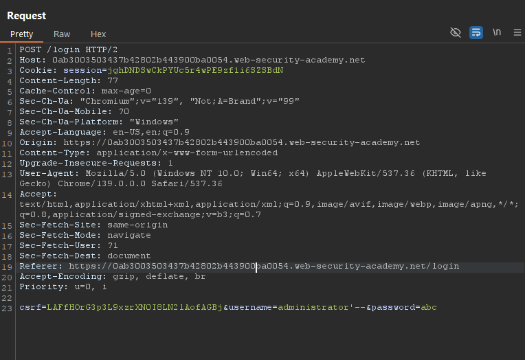
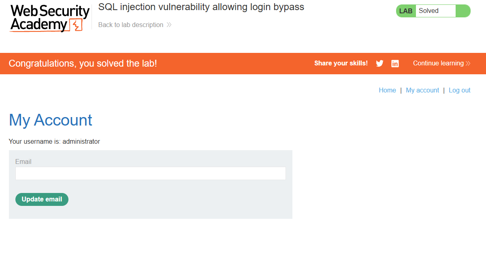

# Laporan Write-Up: SQL Injection Vulnerability Allowing Login Bypass

## 1. Soal

**Nama Challenge:** `SQL Injection Vulnerability Allowing Login Bypass`

**Sumber:** `PortSwigger Web Security Academy`

**Tingkat Kesulitan:** `APPRENTICE`

**Deskripsi Soal:** \
Laboratorium ini memiliki kerentanan SQL Injection pada fungsionalitas formulir login. Tujuan dari eksploitasi ini adalah untuk memanipulasi query autentikasi guna mendapatkan akses ke akun "administrator" tanpa perlu mengetahui kata sandi yang valid.

## 2. Link Resource untuk Latihan

* **Link Soal/Lab:** `https://portswigger.net/web-security/sql-injection/lab-login-bypass`

* **Tools yang Digunakan:**

    * Web Browser

    * HTTP Interception Proxy (Contoh: Burp Suite)

    

## 3. Jawaban dan Bukti

### Langkah-langkah Penyelesaian (Step-by-step)

Berikut adalah dekomposisi langkah-langkah teknis yang dieksekusi untuk menyelesaikan tantangan ini:

1. **Analisis Titik Masuk (Entry Point)**

    Target eksploitasi diidentifikasi pada formulir login yang dapat diakses melalui menu "My Account". Formulir ini memiliki kolom input untuk `username` dan `password`, yang merupakan vektor serangan potensial.

    

2. **Intersepsi Request Autentikasi**

    Menggunakan Burp Suite, sebuah request `POST` standar yang dikirim dari formulir login dicegat. Analisis request menunjukkan bahwa kredensial, bersama dengan token CSRF, dikirim dalam format `application/x-www-form-urlencoded`.

    *Struktur Body Request:*

    ```
    csrf=...&username=user-input&password=pass-input
    ```

    

3. **Konstruksi dan Injeksi Payload**

    Request yang telah dicegat kemudian dikirim ke Burp Repeater untuk manipulasi. Sebuah payload SQL Injection dirancang untuk dieksekusi pada parameter `username`.

    *Payload Injeksi:*

    * `username`: `administrator'--`

    * `password`: (Nilai apa pun, karena akan diabaikan)

    * **Analisis Payload:**

        * `administrator`: Mengisi nilai username dengan target akun yang valid.

        * `'`': Karakter kutip tunggal ini digunakan untuk menutup string literal pada query SQL di sisi backend.

        * `--`: Sintaks ini berfungsi sebagai indikator komentar dalam SQL, yang menyebabkan sisa dari query (termasuk klausa `AND` untuk validasi kata sandi) diabaikan oleh database engine.

    


4. **Eksekusi Serangan dan Validasi**

    * Request `POST` yang telah dimodifikasi dengan payload di atas dikirim ke server. Server memproses query yang telah dimanipulasi dan, karena validasi kata sandi telah di-bypass, server memberikan akses ke akun administrator.

    * Keberhasilan eksploitasi divalidasi ketika server merespons dengan redirect ke halaman akun "administrator". Konfirmasi akhir adalah munculnya spanduk "Congratulations, you solved the lab!".

    Bukti Screenshot (Halaman Akun Administrator & Status Solved):

    

### Catatan Hasil Percobaan

* **Status: Berhasil**

* **Analisis Penyebab:**\
Kerentanan ini timbul dari konstruksi query SQL yang tidak aman di sisi server, di mana input dari pengguna digabungkan secara langsung ke dalam string query.

  * Query Asli (diasumsikan):

    ```sql
    SELECT * FROM users WHERE username = 'user-input' AND password = 'pass-input';
    ```

  * Setelah Injeksi, Query menjadi:

    ```sql
    SELECT * FROM users WHERE username = 'administrator'--' AND password = '...';
    ```

* Dengan adanya sintaks komentar (`--`), bagian `AND` password = `'...'` dari query menjadi tidak aktif. Akibatnya, database engine hanya mengeksekusi `SELECT * FROM users WHERE username = 'administrator'`, yang merupakan query valid dan mengembalikan data pengguna administrator, sehingga autentikasi berhasil.

* **Strategi Remediasi:**

  * **Implementasi Prepared Statements:** Ini adalah metode pertahanan utama dan paling efektif terhadap semua jenis SQL Injection. Dengan parameterized queries, database engine tidak akan pernah mencampuradukkan antara data input dan kode SQL.

  * **Validasi Input Sisi Server:** Menerapkan aturan validasi yang ketat, seperti memeriksa format dan panjang input, untuk mengurangi attack surface.