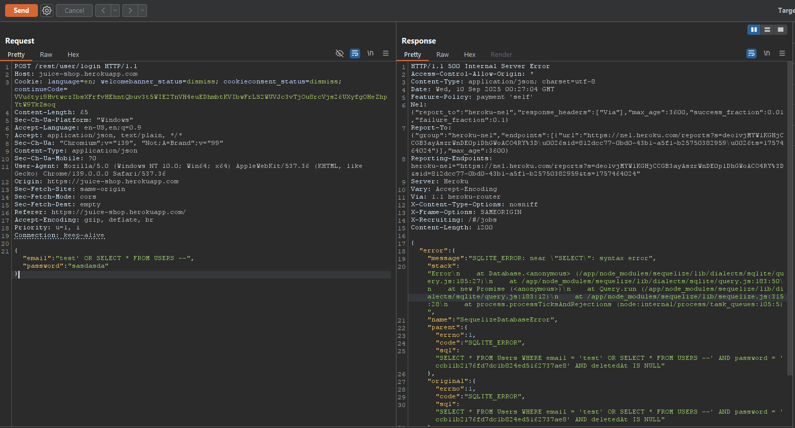
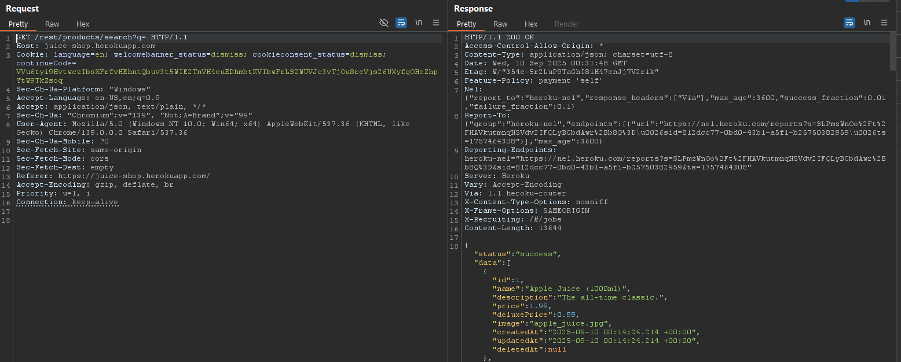
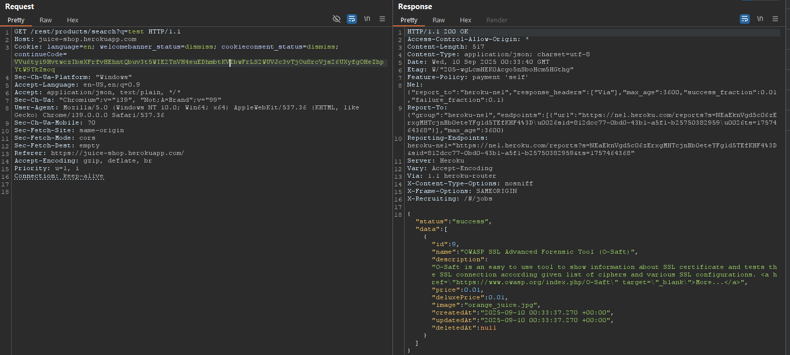
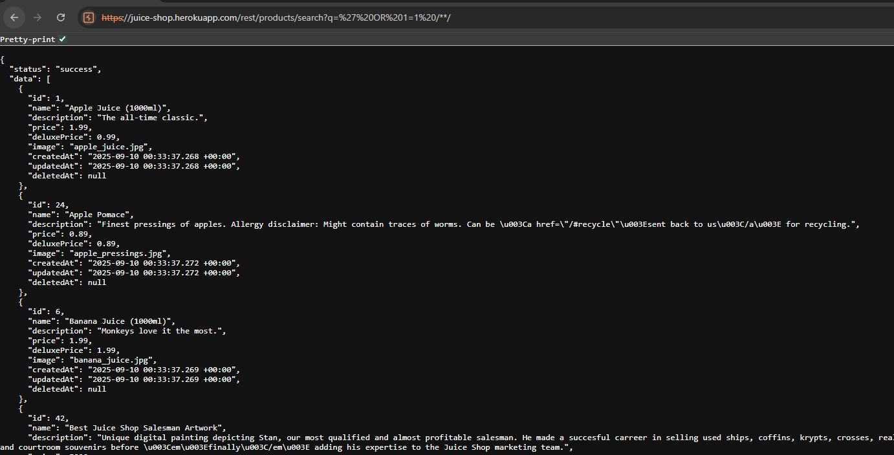
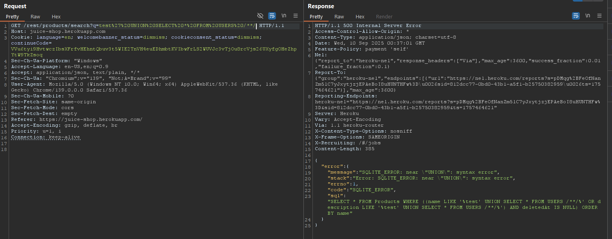
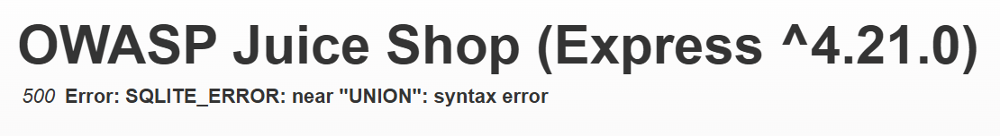
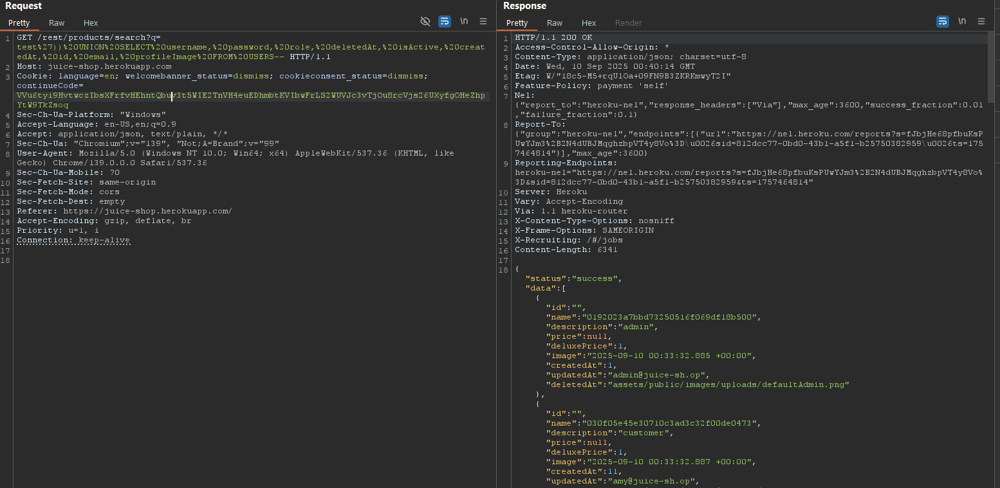

# Laporan Write-Up: Users Credentials (OWASP Juice Shop)

## 1. Soal

**Nama Challenge: Users Credentials**

**Sumber: OWASP Juice Shop**

**Tingkat Kesulitan: ⭐⭐⭐⭐ (4 dari 6)**

**Deskripsi Soal:**

Tantangan ini berfokus pada eksploitasi kerentanan *SQL Injection* untuk melakukan ekfiltrasi data sensitif, yaitu kredensial seluruh pengguna, dari database aplikasi.

## 2. Link Resource untuk Latihan

* **Link Soal/Lab:** https://juice-shop.herokuapp.com/#/login

* **Tools yang Digunakan:**

  * Web Browser (Untuk interaksi dengan aplikasi)

  * HTTP Interception Proxy (Contoh: Burp Suite untuk analisis request)

## 3. Jawaban dan Bukti

### Langkah-langkah Penyelesaian (Step-by-step)

Berikut adalah dekomposisi langkah-langkah teknis yang dieksekusi untuk menyelesaikan tantangan ini:

1. **Identifikasi Vektor Injeksi**

    Investigasi awal dilakukan pada berbagai titik input, namun tidak menemukan vektor yang dapat dieksploitasi. Perhatian kemudian dialihkan ke fungsionalitas pencarian produk pada endpoint `/rest/products/search`, yang diidentifikasi melalui analisis *network traffic* sebagai kandidat kuat karena interaksinya yang langsung dengan database.

    

    

2. **Konfirmasi Kerentanan SQL Injection**

    Endpoint yang teridentifikasi diuji dengan menyisipkan *payload* tautologi sederhana. Pengiriman *query* dengan payload seperti `' OR 1=1--` menghasilkan respons yang mengembalikan seluruh data produk. Hasil ini mengonfirmasi bahwa parameter pencarian rentan terhadap *SQL Injection* karena logika *query* dapat dimanipulasi.

    

    

3. **Enumerasi Struktur Tabel dan Penyesuaian Payload**

    Langkah selanjutnya adalah mengekstrak data dari tabel `Users`. Upaya awal menggunakan `UNION SELECT * FROM Users--` gagal, menghasilkan *error* dari *database engine* yang mengindikasikan ketidakcocokan jumlah kolom antara *query* asli (untuk `Products`) dan *query* yang diinjeksi (untuk `Users`).

    Melalui proses trial-and-error (misalnya dengan ORDER BY N--), jumlah kolom pada result set Products diidentifikasi sebanyak 9 kolom. Dengan informasi ini, payload UNION SELECT harus dirancang untuk mengembalikan 9 kolom agar sintaksnya valid.

    

    

4. **Konstruksi Payload Final dan Ekfiltrasi Data**

    Sebuah *payload* yang lebih spesifik dibangun untuk mencocokkan 9 kolom tersebut dengan memilih kolom-kolom relevan dari tabel `Users`.

    Untuk memenuhi kriteria penyelesaian tantangan, kolom `email` harus disertakan dalam *result set*. Hal ini mengarah pada konstruksi *payload* final.

    *Payload Final:*

    ```sql
    test')) UNION SELECT username, password, role, deletedAt, isActive, createdAt, id, email, profileImage FROM USERS--
    ```

    Eksekusi *payload* final ini berhasil menggabungkan data kredensial pengguna dari tabel `Users` ke dalam respons JSON dari API pencarian produk. Tampilan data sensitif ini dalam respons menandakan keberhasilan eksploitasi dan penyelesaian tantangan.

    

### Catatan Hasil Percobaan

* **Status: Berhasil**

* **Analisis Penyebab:**\
    Kerentanan ini berakar pada praktik *unsafe dynamic query construction*, di mana input pengguna dari parameter pencarian digabungkan secara langsung ke dalam *string query* SQL di sisi *backend*. Ketiadaan sanitasi input atau penggunaan *prepared statements* memungkinkan terjadinya serangan *UNION-based SQL Injection*. Serangan ini memungkinkan penyerang untuk menggabungkan (*union*) *result set* dari *query* yang sepenuhnya dikontrol oleh penyerang dengan *result set* dari query asli yang dimaksudkan oleh aplikasi, sehingga menyebabkan ekfiltrasi data dari tabel lain dalam database.

* **Strategi Remediasi:**\
    Untuk memitigasi risiko ekfiltrasi data melalui SQL Injection, beberapa kontrol keamanan fundamental harus diterapkan:

    1. **Implementasi Prepared Statements:** Penggunaan *parameterized queries* adalah metode pertahanan utama, memastikan bahwa *database engine* tidak pernah menginterpretasikan input pengguna sebagai bagian dari perintah SQL.

    2. **Prinsip Hak Istimewa Terkecil (*Least Privilege*):** Akun database yang digunakan oleh aplikasi web seharusnya hanya memiliki izin `SELECT` pada kolom-kolom yang benar-benar diperlukan untuk fungsionalitasnya, bukan akses ke data sensitif seperti *password hash*.

    3. **Validasi dan Sanitasi Input:** Menerapkan validasi sisi server yang ketat untuk menolak *query* yang mengandung metakarakter atau sintaks SQL yang mencurigakan.