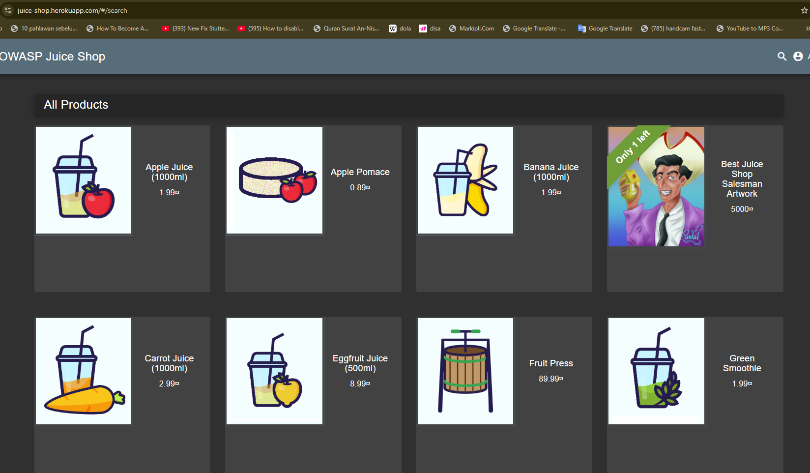
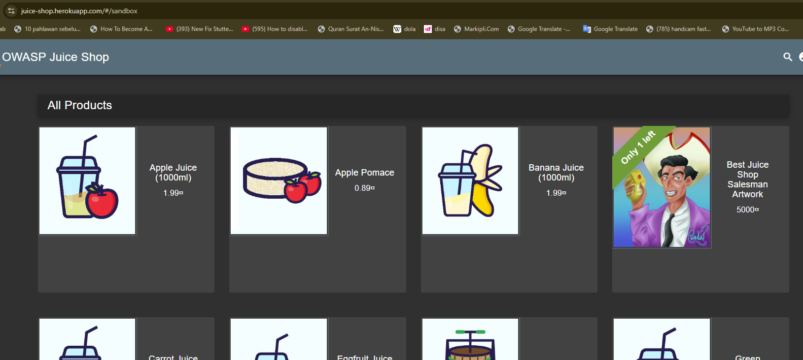
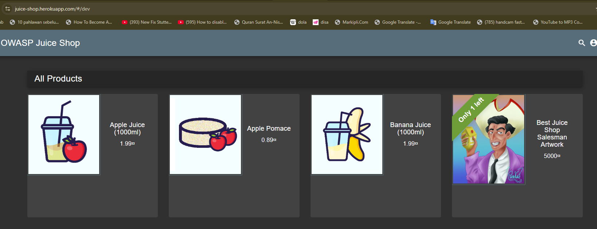
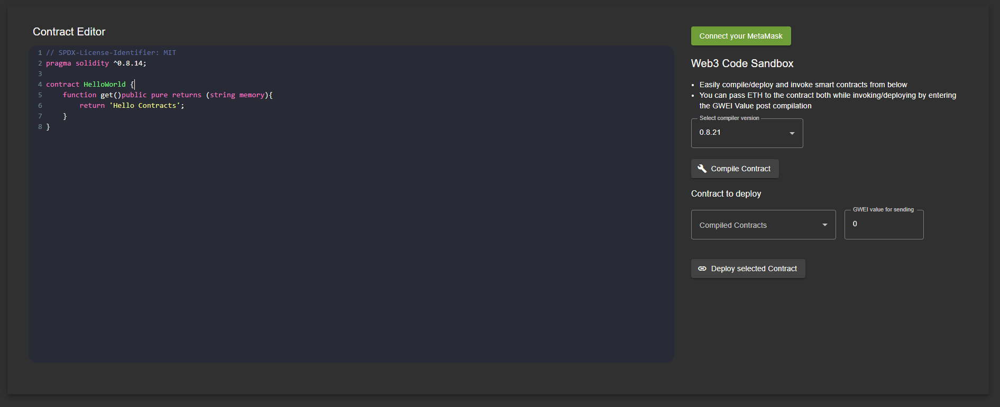

# Laporan Write-Up: Web3 Sandbox (OWASP Juice Shop)

## 1. Soal

**Nama Challenge:** `Web3` Sandbox

**Sumber:** `OWASP Juice Shop`

**Tingkat Kesulitan:** `⭐ (1 dari 6)`

**Deskripsi Soal:**\
Tantangan ini berfokus pada penemuan endpoint tersembunyi yang mengarah ke sebuah sandbox pengembangan Web3. Kerentanan ini termasuk dalam kategori Broken Access Control, di mana fungsionalitas internal atau eksperimental secara tidak sengaja diekspos ke publik tanpa mekanisme kontrol akses yang memadai.

## 2. Link Resource untuk Latihan

* **Link Soal/Lab:** `https://juice-shop.herokuapp.com/`

* **Tools yang Digunakan:**

  * Web Browser

## 3. Jawaban dan Bukti

### Langkah-langkah Penyelesaian (Step-by-step)

Berikut adalah dekomposisi langkah-langkah teknis yang dieksekusi untuk menyelesaikan tantangan ini:

1. **Fase Rekognisi (Reconnaissance)**

    Investigasi awal dilakukan dengan hipotesis bahwa aplikasi mungkin memiliki direktori atau path tersembunyi yang terkait dengan fungsionalitas pengembangan atau pengujian. Fokusnya adalah pada endpoint yang berhubungan dengan teknologi Web3.

    

2. **Penemuan Endpoint Melalui Forced Browsing**

    * Teknik forced browsing atau enumerasi direktori manual digunakan untuk menemukan path yang tidak tertaut dari antarmuka utama. Berdasarkan nama-nama direktori pengembangan yang umum (`/sandbox`, `/test`, `/dev`), beberapa variasi URL dicoba.

    

    

    

    * Upaya ini berhasil mengidentifikasi path yang valid: `/#/web3-sandbox`.

    

3. **Akses dan Validasi**

    * Mengakses URL `http://<juice-shop-host>/#/web3-sandbox` secara langsung di browser mengarahkan ke antarmuka sandbox Web3 yang berfungsi penuh.

    * Sandbox ini menyediakan fungsionalitas untuk menulis, mengompilasi, dan men-deploy smart contract Ethereum secara on-the-fly, yang mengonfirmasi penyelesaian tantangan.

    *Bukti Screenshot (Antarmuka Web3 Sandbox):*

    

### Catatan Hasil Percobaan

* **Status: Berhasil**

* **Analisis Penyebab:**\
Akar masalah dari kerentanan ini adalah **Security** Misconfiguration dan **Broken Access Control**. Lingkungan sandbox yang seharusnya hanya digunakan untuk keperluan pengembangan internal, secara tidak sengaja ikut ter-deploy ke lingkungan produksi dan tidak dilindungi oleh mekanisme autentikasi atau otorisasi. Akibatnya, endpoint tersebut dapat diakses oleh siapa saja yang mengetahui atau berhasil menebak URL-nya (predictable resource location).

* **Strategi Remediasi:**\
Untuk mencegah insiden serupa, praktik keamanan berikut sangat direkomendasikan:

  1. **Pemisahan Lingkungan (Environment Segregation):** Memastikan pemisahan yang ketat antara lingkungan pengembangan, pengujian, dan produksi. Fungsionalitas atau tools yang tidak relevan untuk produksi harus dihilangkan sepenuhnya dari build produksi.

  2. **Implementasi Kontrol Akses yang Kuat:** Semua endpoint yang bersifat administratif atau sensitif harus dilindungi oleh kontrol akses berbasis peran (Role-Based Access Control - RBAC) yang kuat.

  3. **Audit Konfigurasi Keamanan:** Melakukan audit secara berkala untuk memastikan tidak ada file, direktori, atau endpoint sisa dari proses pengembangan yang terekspos di server produksi.

  4. **Penonaktifan Directory Listing:** Menonaktifkan fitur directory listing pada level web server untuk mempersulit penyerang dalam melakukan enumerasi direktori.