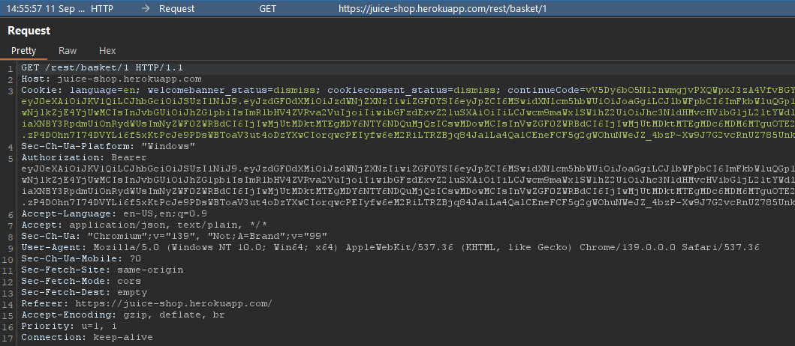
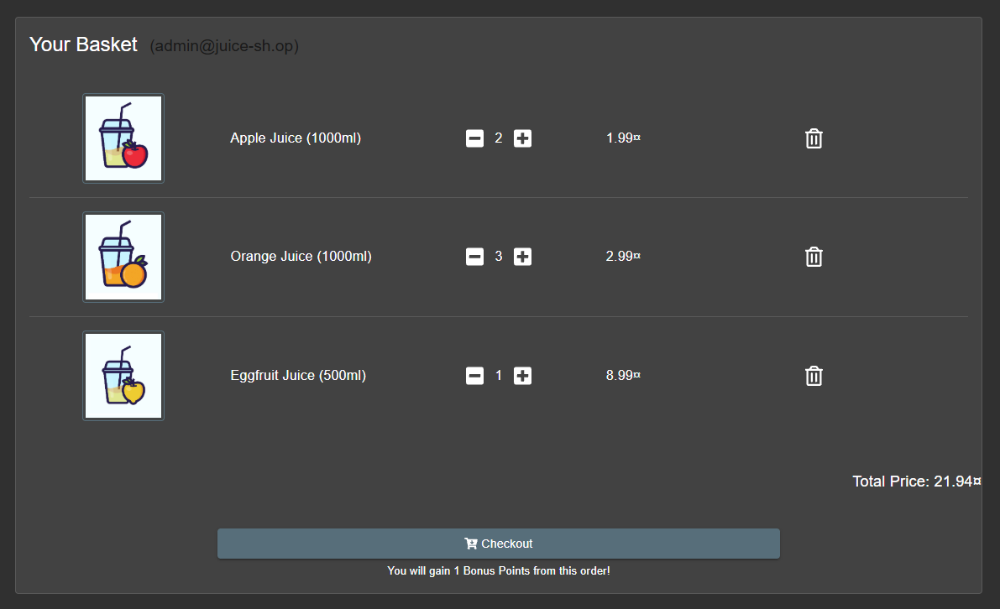
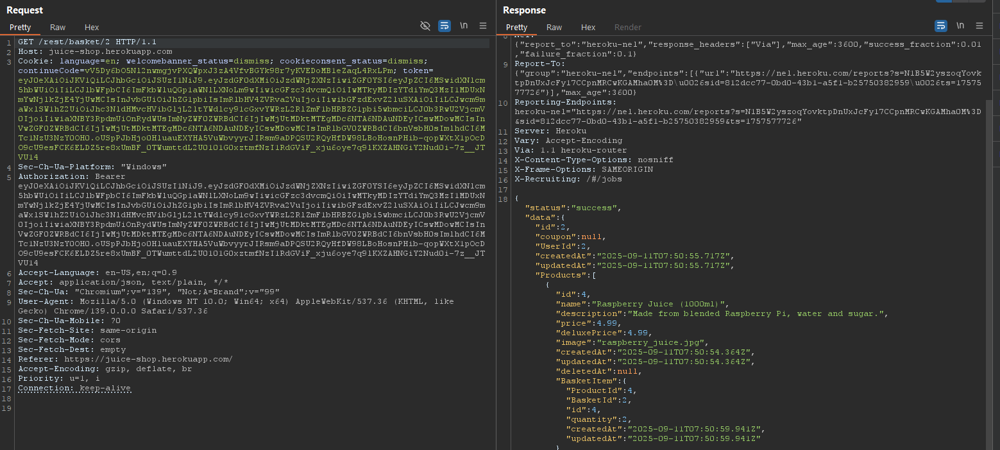
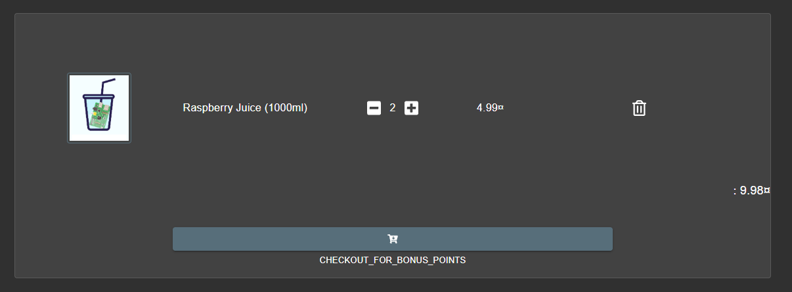

# Laporan Write-Up: View Basket (OWASP Juice Shop)

## 1. Soal

**Nama Challenge:** `View Basket`

**Sumber:** `OWASP Juice Shop`

**Tingkat Kesulitan:** `⭐⭐ (2 dari 6)`

**Deskripsi Soal:**\
Tantangan ini berfokus pada eksploitasi kerentanan Broken Access Control. Tujuannya adalah untuk mengakses data keranjang belanja (shopping basket) milik pengguna lain dengan cara memanipulasi identifier yang dikontrol oleh pengguna dalam request HTTP.

## 2. Link Resource untuk Latihan

* **Link Soal/Lab:** `https://juice-shop.herokuapp.com`

* **Tools yang Digunakan:**

  * Web Browser

  * HTTP Interception Proxy (Contoh: Burp Suite)

## 3. Jawaban dan Bukti

### Langkah-langkah Penyelesaian (Step-by-step)

Berikut adalah dekomposisi langkah-langkah teknis yang dieksekusi untuk menyelesaikan tantangan ini:

1. **Analisis Fungsionalitas dan Intersepsi Request**

    Fungsionalitas untuk melihat keranjang belanja diakses dan request `GET` yang terkait dicegat menggunakan Burp Suite. Analisis menunjukkan bahwa request dikirim ke sebuah endpoint RESTful yang menyertakan ID keranjang belanja langsung di dalam URL.

    *Contoh Request Asli:*

    ```
    GET /rest/basket/1 HTTP/1.1
    Host: <juice-shop-host>
    ```

    Angka `1` pada path URL diidentifikasi sebagai user-controllable identifier yang kemungkinan merepresentasikan `basketId` milik sesi pengguna saat ini.

    

    


2. **Identifikasi Kerentanan IDOR (Insecure Direct Object Reference)**

    Kehadiran identifier yang dapat diprediksi dan dimanipulasi dalam URL adalah indikator kuat adanya potensi kerentanan IDOR, sebuah sub-kategori dari Broken Access Control. Hipotesisnya adalah bahwa backend tidak melakukan validasi kepemilikan data sebelum mengembalikan informasi keranjang belanja.

3. **Manipulasi Parameter dan Eskalasi Akses**

    Request yang telah dicegat dikirim ke Burp Repeater. Nilai `basketId` pada URL dimodifikasi dari `1` menjadi `2` (atau nilai integer lainnya) dalam upaya untuk mengakses objek data milik pengguna lain.

    *Request yang Dimodifikasi:*

    ```
    GET /rest/basket/2 HTTP/1.1
    Host: <juice-shop-host>
    ```

    


4. **Validasi Eksploitasi**

    * Request yang telah dimodifikasi dikirim ke server. Server merespons dengan data JSON yang berisi detail produk dari keranjang belanja milik pengguna lain, bukan milik pengguna yang sedang login.

    * Respons ini mengonfirmasi bahwa tidak ada pemeriksaan otorisasi yang dilakukan di sisi server, sehingga berhasil mengeksploitasi kerentanan dan menyelesaikan tantangan.

    *Bukti Screenshot (Request Dimodifikasi & Respons Keranjang Pengguna Lain):*

    

### Catatan Hasil Percobaan

* **Status: Berhasil**

* **Analisis Penyebab:**\
  Akar penyebab kerentanan ini adalah kegagalan mekanisme kontrol akses di sisi server. Aplikasi secara keliru mempercayai identifier yang disediakan oleh klien (`basketId`) tanpa melakukan verifikasi apakah pengguna yang membuat request tersebut benar-benar memiliki otorisasi untuk mengakses objek data yang diminta. Ini adalah contoh klasik dari kerentanan Insecure Direct Object Reference (IDOR), di mana penyerang dapat melintasi batasan otorisasi hanya dengan memanipulasi parameter.

* **Strategi Remediasi:**\
  Untuk memitigasi kerentanan IDOR dan memperkuat kontrol akses, praktik berikut harus diimplementasikan:

  1. **Validasi Kepemilikan Sisi Server:** Untuk setiap request yang mengakses sumber daya spesifik pengguna, server harus selalu memvalidasi bahwa identifier pengguna dari sesi saat ini cocok dengan pemilik sumber daya yang diminta. Misalnya, `SELECT * FROM Baskets WHERE id = ? AND owner_id = ?`, di mana `owner_id` diambil dari data sesi yang terpercaya.

  2. **Hindari Penggunaan Direct Object References:** Mengganti identifier numerik yang mudah ditebak (seperti `1`, `2`, `3`) dengan identifier acak yang tidak dapat diprediksi (unpredictable), seperti UUIDs (Universally Unique Identifiers). Hal ini mempersulit penyerang untuk melakukan enumerasi.

  3. **Implementasi Kontrol Akses Terpusat:** Menggunakan middleware atau framework keamanan untuk menerapkan pemeriksaan kontrol akses secara konsisten di semua endpoint yang sensitif.